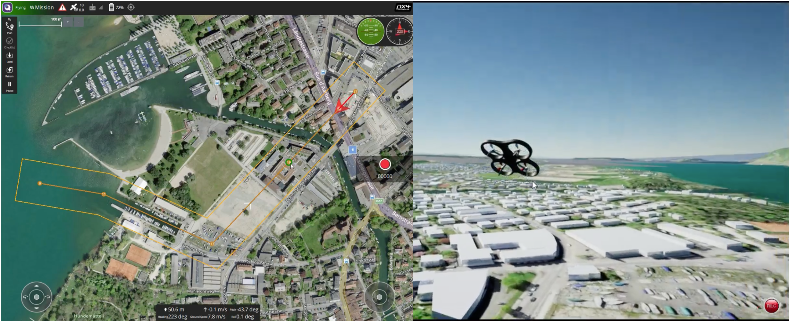

# High-Fidelity UAV Simulation Tool for the Support of SORA Process Based Validation of Operational Flight Volume and Ground Risk Buffer

The growth of unmanned aerial vehicle (UAV) applications is driving the development of ever-evolving drone regulations that provide higher safety standards for the industry, but also increase the hurdles for drone operators and pilots to obtain their flight permits where they are required. These hurdles are mainly financial due to the extensive approval process (SORA process) of operator procedures including all the required documentation. The aim of the Master's thesis was to test a new way to reduce the financial hurdle for new flight permits by testing certain procedures in simulation and avoiding costly tabletop or on-site testing.

_Figure: The round control station of the simulation on the left and the rendering of the flight mission on right. The mission could be steered either through the ground control station or an offboard control script in Python. The latter was the choice for the majority of the master thesis._

In collaboration with [incluas GmbH](https://incluas.ch/de/enhomedehome-deutsch/), a company specialising in SORA approvals for drone applications, a simulation approach was developed to validate some of their procedures, including the size of flight corridors and safety zones. The applicability of such UAV simulations has been successfully demonstrated for various applications in industry and academia, but has not yet been used to support SORA approvals. Therefore, the chosen high-fidelity UAV simulator focused on a modular architecture and open-source software components to allow the necessary adaptations for the goal of the underlying thesis. A variety of different components such as Gazebo, PX4, Unreal Engine and AirSim were used in an integrated manner to answer the research questions. Derived from them, different experiments were used to validate the size of the ground risk buffer and the contingency volume for the intended use case in Biel at the [SIPBB](https://www.sipbb.ch/). 

_Figure: The results show the validation of the size of the ground risk buffer at different wind speeds and directions. The left graph shows the crash site after successful application of the emergency procedure (rotor shutdown) and the right graph shows the loss of altitude in relation to the horizontal distance during the procedure._

The simulation was verified with real test flights to ensure reliable results from the UAV simulation model adapted to reproduce the performance characteristics of the DJI M300 RTK. Further analysis and interpretation of the results allowed recommendations to be made to the team at incluas for various adjustments to the operating parameters. Finally, improvements for further research were identified mainly in the area of user-friendliness of the simulation tool, support for different UAV models and the inclusion of an improved terrain model. 

[Back](https://intelligentsystemsgroup.github.io/pages/research.html)