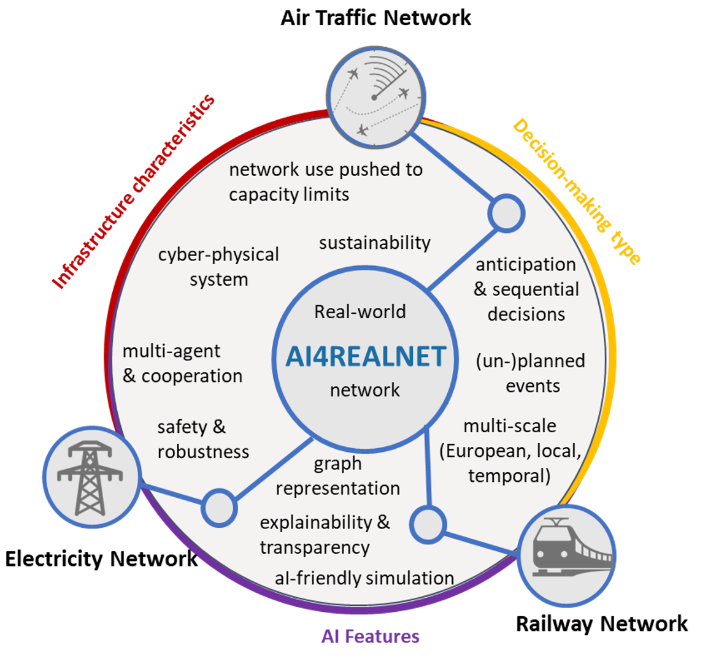

The European research project AI4REALNET aims to develop AI-based solutions for real-world networks and critical systems  (i.e., electricity, railways and air traffic) 
that are traditionally operated by humans. The solutions are intended to be ethical, explainable with a focus on complementing and extending human capabilities through 
artificial intelligence. 

_Figure: The AI4REALNET project with the three infrastructures defined as critical as well as some milestones that will be developed during the project._

AI4REALNET is a Horizon Europe funded research project with a total of nine partner universities and research technology organizations (RTOs) and six industrial partners. 
AI4REALNET aims to develop a comprehensive multidisciplinary approach that combines emerging AI algorithms, open-source digital environments and socio-technical design 
to effectively operate network infrastructures both in real-time and predictively. The project will test and evaluate AI in industry-relevant use cases, focusing on 
three critical infrastructures: power grids, railway systems and air traffic management. These infrastructures are considered vital due to the severe societal 
consequences which would follow their disruption.

The AI4REALNET team envisions a harmonious coexistence of humans and AI, guaranteeing a high degree of human control over the AI-based automation. This coexistence is 
categorized into the following three levels: Full human control with AI support, joint AI-human learning including adaptive autonomy, and trustworthy human-certified 
full AI-based control. Another focus of the project is the development of hybrid decision systems, where AI and humans work together in teams and use the capabilities 
of AI to improve mission-critical operations. AI4REALNET aims to redesign these systems by integrating AI to achieve optimal performance.

The team at the “Intelligent Systems and AI in Aviation” research group is heavily involved in the development of the project, is primarily concerned with 
fully AI-based decision systems with a focus on the railway domain, and is strongly involved in research and development of co-learning with Deep RL (Deep 
Reinforcement Learning), XAI (Explainable AI) and RL for large networks. The team also contributes to the improvement of the Flatland simulation environment.

### Acknowledgment
This is a funded research project by the European Union and their research initiative Horizon Europe. The project is 
ongoing with a start in September 2023. 

[Back](https://cyberneticlearningsystems.github.io/pages/research.html)