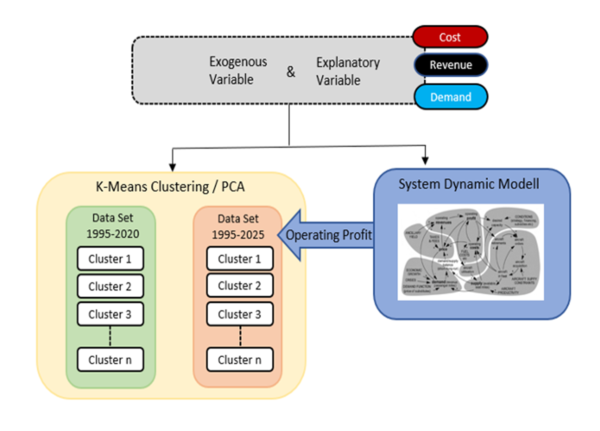
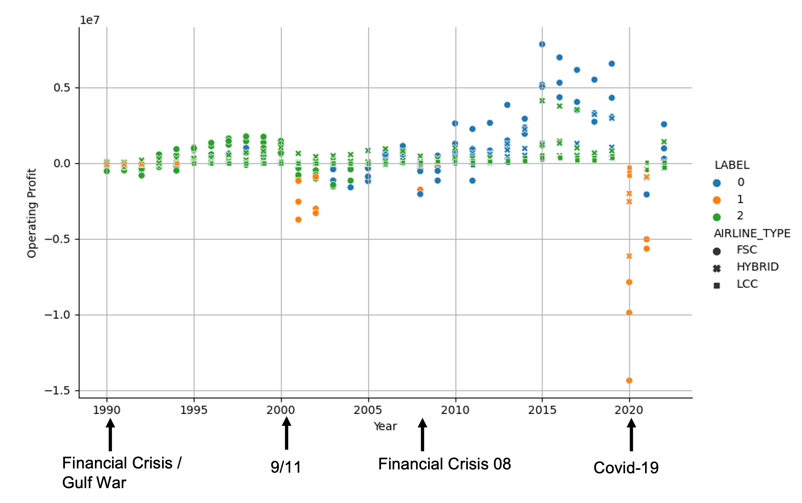

_Figure 1: Conceptual model of the airline profit simulation and the subsequent clustering/PCA approach._

The airline industry follows a strongly cyclical profit development, which brings high profits but also huge losses with a period of about 10 years. The causes and effects are studied using a wide range of statistical techniques, artificial intelligence and simulation methods.

The aviation industry shows a strongly cyclical behavior in terms of profitability. Profit fluctuations are mainly caused by a variety of endogenous and exogenous factors that exert the strong competitive pressure on airlines. Airlines are interested in recognizing the time of expected declines in order to choose the right strategy within their business environments.

For conference participation and journal publication, system dynamics models were used to represent the internal mechanisms and to simulate and predict the profit cycles. The subsequent research included regression analysis, PCA and clustering approaches to investigate the internal mechanisms and especially their changes over time.

_Figure 2: The profit cycles of different US airlines including their business models and their clustering in green (cost-efficient operation), blue (cost-inefficient operation) and orange (crisis mode)._

Currently, the different business models and their changes over the past 30 years are also being examined in order to better classify individual airlines in their industrial context. In the future, not only industry-specific endogenous variables, but above all macroeconomic KPIs are to be used so that changes and the identification of the right strategy can happen even earlier. The research group is increasingly focusing on the application of existing and the development of new algorithms from the field of machine learning.

[Back](https://isandaiinaviation.github.io/pages/research.html)

