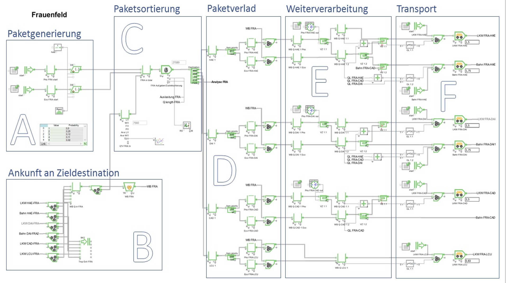
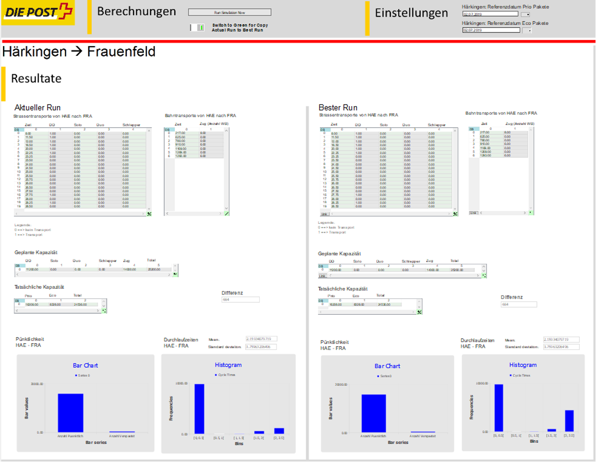

In cooperation with Swiss Post, our research group has developed a digital twin for the optimisation of parcel logistics on Swiss Post's rail and road network. The 
optimisation algorithm is based on a digital twin that was initially developed in two subsequent project works by Master students. The digital twin, which is based on 
discrete-event simulation, was further developed by Manuel Renold and his team. The model is now able to optimise the resource allocation of freight wagons across the 
Swiss Post rail fleet and trucks on the road. The combinatorial optimisation algorithm solves the vehicle routing problem (VRP) using integer programming to find the 
globally optimal solution from the discrete set of all feasible solutions.

_Figure 1: A cut-out of the model of the digital twin for the parcel logistics centre in Frauenfeld._

The digital twin model is already available as a prototype to test its ability to support the dispatcher in finding the optimal way to transport the parcel between the 
logistics centre in Frauenfeld and Härkingen. A GUI has been developed to allow the dispatcher to see the solution computed by the optimisation algorithm, to add 
constraints to the algorithm before it is re-run, and to test certain What-If scenarios by re-assigning transports at his request, with the digital twin testing the 
consequences in the background.

_Figure 2: Representation of the prototype's GUI to adjust the optimisation algorithm and run What-If scenarios._

The digital twin model is designed in a modular way, which makes it possible to quickly add new logistics centres to build up the entire logistics network of Swiss Post 
and to test the economic and ecological benefits of investing in new logistics infrastructure. Future developments include considering replacing the current combinatorial
optimisation algorithm with alternatives from the fields of machine and reinforcement learning, whereby synergies with other projects such as the [Flatland Association](./../news.md)
would be exploited

### Acknowledgment

This project is based on a digital twin initially developed by two Master's students in the first and second half of 2020, since then continued by our research group 
with direct funding from Swiss Post.

[Back](https://cyberneticlearningsystems.github.io/pages/research.html)