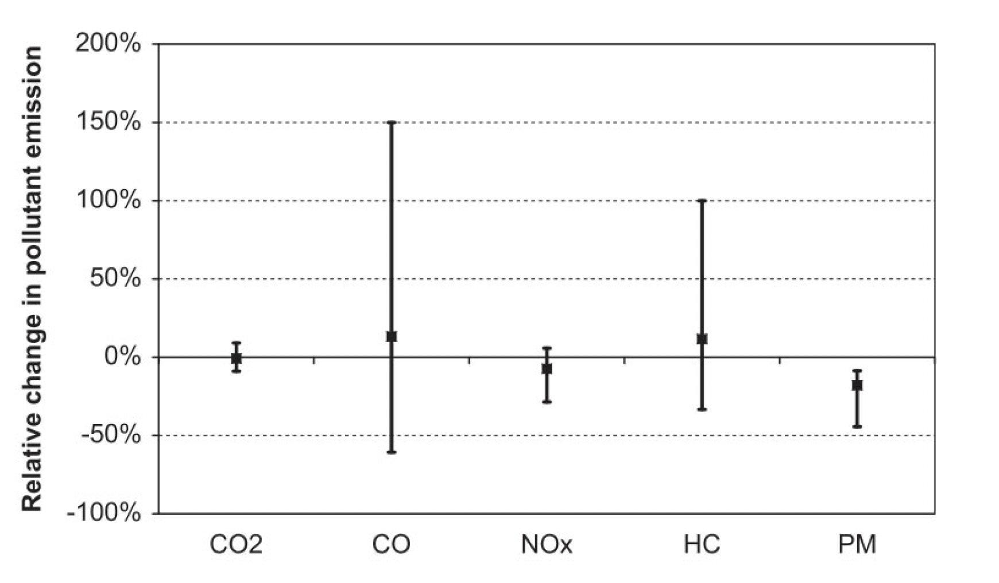

On behalf of the Zurich Environmental and Health Protection (UZG) agency, a literature study was carried out to gather the most important scientific findings regarding the 
connections between traffic planning measures and air quality. The findings served as a scientific basis for decision-making on the remediation plans for the 
Bellerivestrasse.

_Figure: Percentage change in emission levels with a speed reduction from 50 km/h to 30 km/h._

The City of Zurich commissioned the research group at the IDP in cooperation with the Centre for Aviation to conduct a literature study focusing on the relationship 
between traffic flow, driving speed and pollutant emissions. The focus was on the reduction of driving speed from 50 km/h to 30 km/h, the emission differences between 
the traffic modes "green wave" vs. "stop-and-go" and the reduction of lanes from four to two. 

The findings obtained served the city of Zurich as a scientific basis for the traffic regulation measures planned for Bellerivestrasse at the time, which had the goal of 
reducing traffic congestion, lowering noise emissions, and promoting green mobility.

### Acknowledgment
This project was funded by the Department of Environment and Health Protection (UZG) of the Canton of Zurich. The project finished in January 2020.

[Back](https://intelligentsystemsgroup.github.io/pages/research.html)