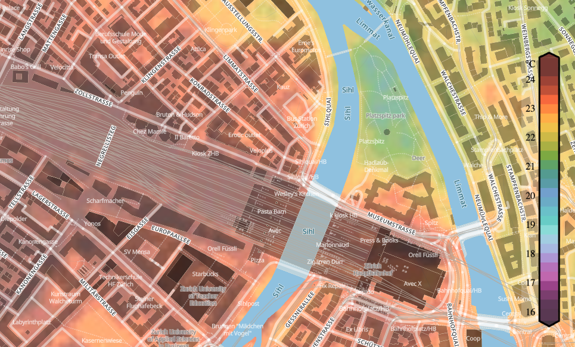

In cooperation with Meteoblue, the aim of the urban climate project was to produce high-resolution temperature maps of the city of Zurich. The maps were generated using a Generative 
Adversarial Network (GAN), which draws data from large-scale weather model. The training data set for the algorithms used consisted of a network of over 250 measuring 
stations within the city of Zurich.

_Figure: Heat-Map of Zurich showing the forecasted temperature differences within the city._

The Meteoblue Urban Climate project combines state-of-the-art methods from the field of machine learning to form a novel pipeline for the generation of high-resolution 
(HR) urban temperature maps. The proposed method is two-fold, utilising an adapted regression forest (RF) technique to generate dense HR temperature maps using datapoints 
from a sparse in-situ measurement network and a series of meteorological (dynamic) and geospatial (static) feature variables. The measurement network encompasses over 250 stations throughout 
urban Zurich, delivering temperature and humidity measurements every 10 minutes over two years. By adjusting geospatial features, it becomes possible to evaluate the 
influence of urban projects (for example greening or removal of parks) on temperature at that specific location as well as surrounding areas.

The temperature maps generated by the RF serve as a training dataset for a Generative Adversarial Network (GAN), which is trained to perform super-resolution of up to 50x under 
consideration of physical processes and the city’s specific behaviour patterns. The trained GAN can then be fed with predictions from large-scale models to generate HR 
super-resolutions thereof. 

Click [here](https://www.meteoblue.com/en/products/cityclimate/heatmaps/zurich#15.11/47.375641/8.53596) for Meteoblue’s heat map of the city of Zurich or listen to [SRF's radio report](https://www.srf.ch/audio/rendez-vous/meteoblue-temperatur-innerhalb-von-staedten-variiert-stark?partId=12421630) on the topic.

### Acknowledgment
This project was funded by Innosuisse in the period between 2018 and 2022.

[Back](https://isandaiinaviation.github.io/pages/research.html)
