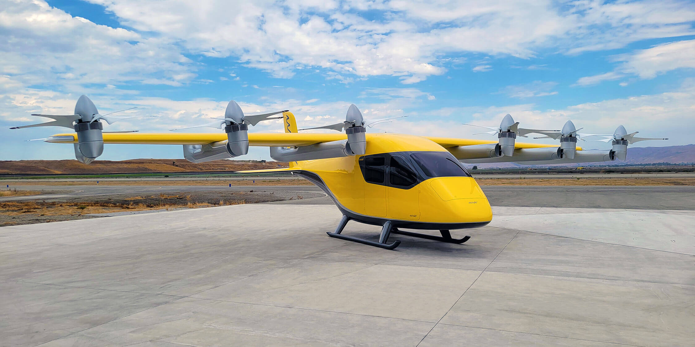
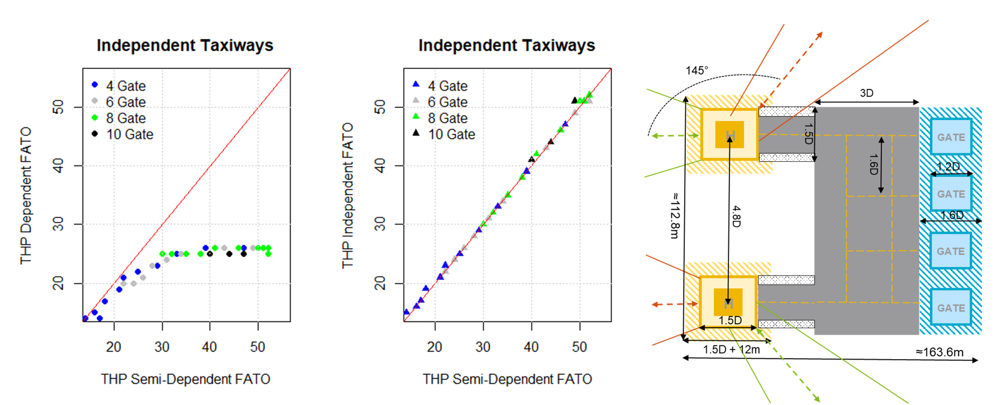

In collaboration with Aurora Flight Sciences and Wisk Aero, simulations for the operation of different vertiport layouts were created. A vertiport is the critical 
infrastructure for handling air taxis and their passengers in future urban air mobility applications.

_Figure 1: Wisk’s 6. generation eVTOL with a range of 144 km, a cruising speed of 120 knots and a capacity of 4 passengers with carry-on luggage._

Aurora Flight Sciences and Wisk Aero are subsidiaries of Boeing and are involved in the development of eVTOLS (Electrical Vertical Take-Off and Landing Vehicles), or air 
taxis. Their use in future urban air mobility applications should offer a cheap, fast and environmentally friendly alternative to conventional means of transport. Crucial 
for the fast handling of passengers and eVTOLS are the vertiports as ground infrastructure, comparable to airports for conventional aircraft. 

_Figure 2: Evaluation of the maximum possible hourly landings and take-offs with different operating concepts (left) as well as a possible vertiport layout with 4 gates 
and 2 landing pads, which can be operated semi-dependent (right)._

Due to the lack of operational experience with vertiports, the team at the IDP developed discrete-event simulations to investigate various layouts with different numbers 
of gates and landing pads. Furthermore, various sensitivity analyses and evaluations were carried out to optimize the handling processes of the air taxis and to increase 
the hourly throughput per vertiport. The necessary resources in the form of towing tractors and ground staff were also planned and optimized for the layouts investigated. 
The study is a decisive contribution to the development of a valid and economically attractive business model.

### Acknowledgment
This ongoing project started in 2019 and was funded in three phases by Aurora Flight Sciences and Wisk Aero.

[Back]({{ site.baseurl }})