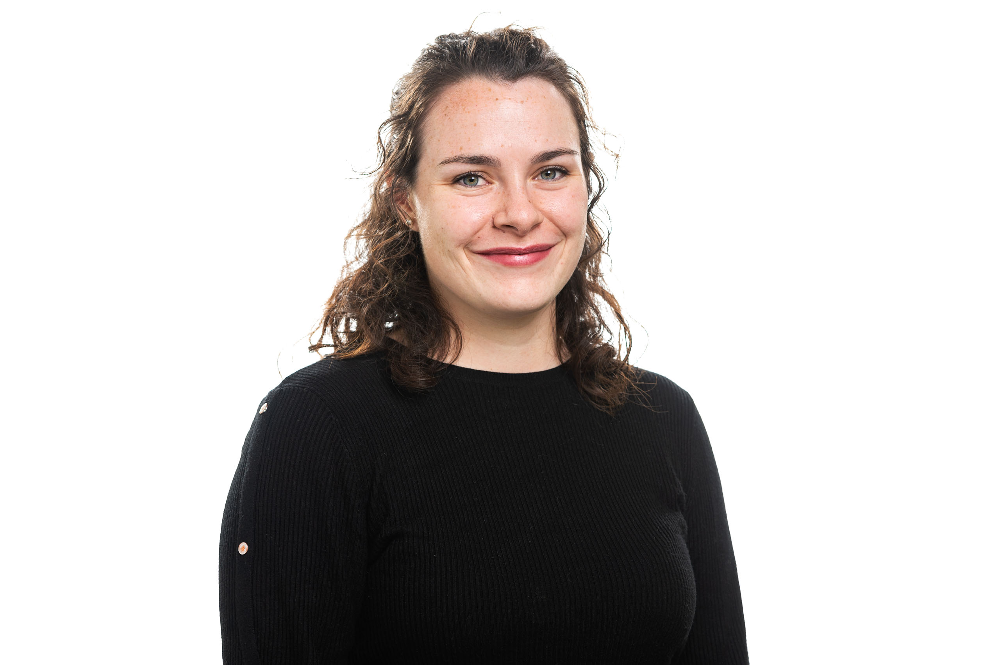
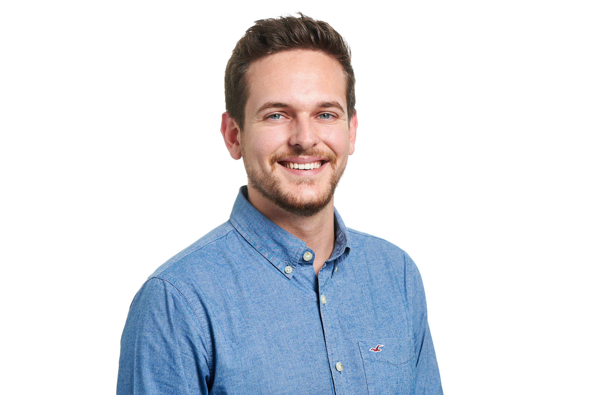

# **Who are we?**
We are a small team consisting of three curious people interested in developing innovative solutions to problems in a diverse range of use-cases. We love to tackle big problems
that require new approaches and live by the motto "If you can think it, you can achieve it". We'd love to take this opportunity to introduce ourselves:

 

### Dr. Manuel Renold - Team Lead

<!--The code below is only used as spacer-->
<html>
  
ONLY_HERE_AS_SPACER

</html>
<!--The code below is only used as spacer-->
<html>
  
ONLY_HERE_AS_SPACER

</html>
<!--The code below is only used as spacer-->
<html>
  
ONLY_HERE_AS_SPACER

</html>
<!--The code below is only used as spacer-->
<html>
  
ONLY_HERE_AS_SPACER

</html>

Feel free to visit Manuel on [LinkedIn](https://www.linkedin.com/in/manuel-renold-46b07287/).
 

### Julia Usher - PhD Candidate

Julia began her academic career in 2017 with the beginning of her BSc. in Aviation at the Zurich Univeristy of Applied Sciences. It was after her Bachelor's that she began
working as a research assistant in Manuel's team while completing her Master's in Engineering from 2020-2023, deepening her knowledge of statistical methods, optimisation
and discovering a fascination for AI and ML. The culmination of three years of employment and studies was her Master Thesis, in which she developed a proof of concept for a
reinforcement learning agent for the scheduling of ground handling equipment, proving the validity of the method proposed in the [brAIght](./projects/braight.md) project. The next step in her career
is now underway - she will stay on in Manuel's team as a PhD Candidate, working primarily for the [AI4REALNET](./projects/ai4realnet.md)
project in the field of human-machine co-learning and the continuation of her Master's Thesis in the [brAIght](./projects/braight.md) project.

After a day's work, you're most likely to find Julia with a volleyball in hand or - as the green thumb of the group - taking care of her urban jungle at home. The weekends  
of the warmer months are mostly spent outside on "relaxing" alpine hikes and nights sleeping outside under the stars. While still hiking in winter, she's more likely to
be spotted on her skis (or next to them).

[LinkedIn](https://www.linkedin.com/in/juliausher/).
<!--The code below is only used as spacer-->
<html>
  
ONLY_HERE_AS_SPACER

</html>

### Janik Vollenweider - Researcher

Janik completed his BSc. in Aviation in 2020 and continued his Master in Engineering with specialisation in Aviation from 2020 to 2023. He gained professional
experience in the transport industry at SBB and during his bachelor's degree through an internship at Zimex Aviation followed by part-time employment. During his 
master's degree, Janik started as a research assistant in Manuel's team. He mainly focused on the development of the Vertiport simulation in cooperation with Wisk and 
Aurora Flight Sciences. Through his knowledge of agent-based simulation, acquired during his bachelor thesis, he also assisted in lectures on passenger flow simulations 
at airports. He demonstrated his knowledge of airline profit in a project thesis during his master's degree and was involved in the underlying research within the group.

As the drone nerd in the group, he focused his master's thesis on developing a high-fidelity UAV simulation to validate operational flight procedures that require a 
permit to fly. Together with the start-up [incluas](https://incluas.ch/), he explored new ways to reduce the costs of real-flight tests required for drone operations that require a 
flight approval. When he's not sitting behind his desk, he's repairing and tuning his FPV drones or enjoying the freedom of pushing them through tiny gaps or flying 
them at speeds of up to 120 km/h within half a metre of the ground... a lot of crashes included. True to the motto "Fail Fast, Fail Often!"

[LinkedIn](https://www.linkedin.com/in/janik-vollenweider-1144bb1a2)