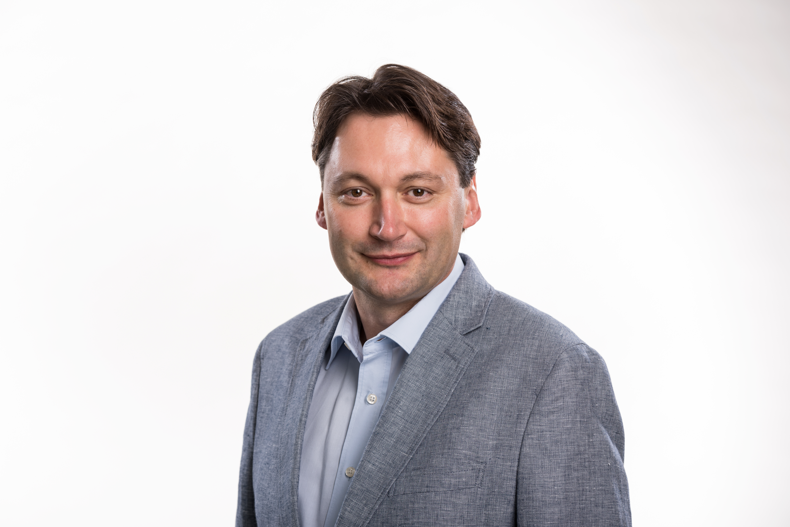
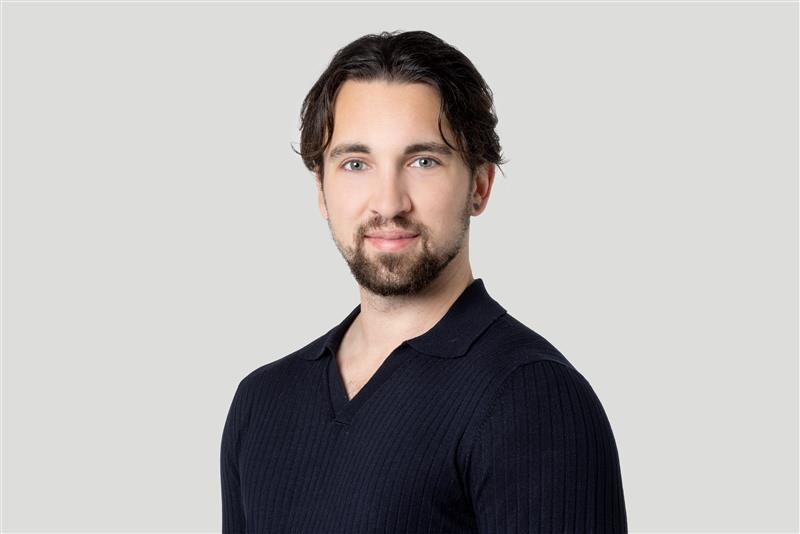
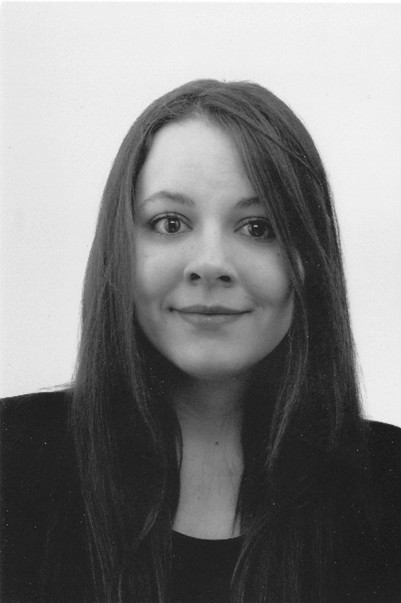
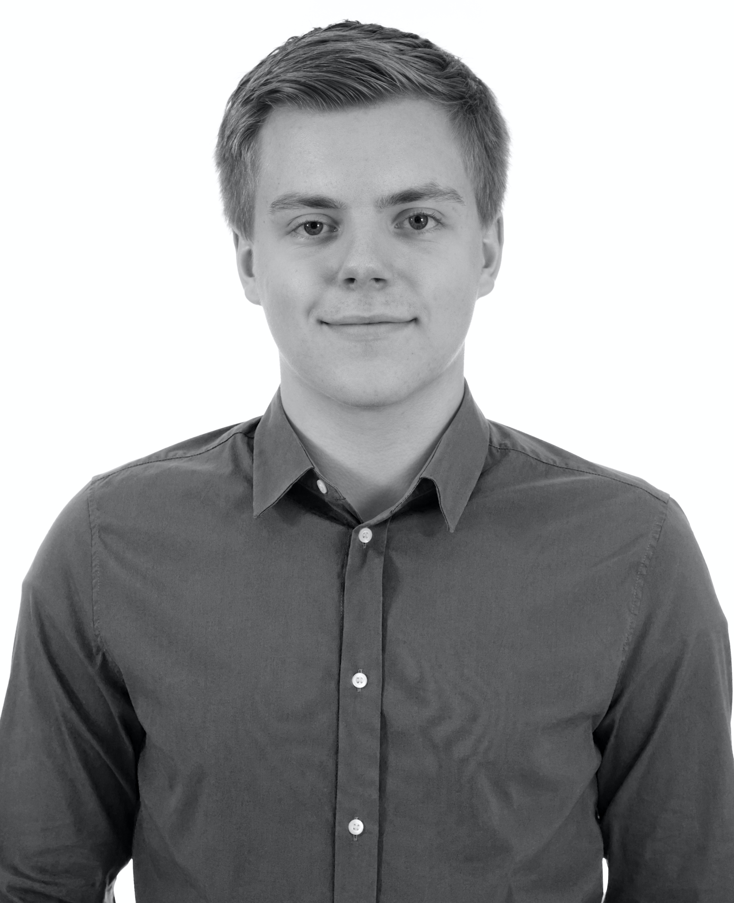

# **Who are we?**
We are a small team consisting of five curious people interested in developing innovative solutions to problems in a diverse range of use-cases. We love to tackle big problems
that require new approaches and live by the motto "If you can think it, you can achieve it". We'd love to take this opportunity to introduce ourselves:

 

### Prof. Dr. Manuel Renold - Team Lead

<!--   -->

As a physicist, mathematician, computer scientist, former climatologist and simulation oceanographer, Manuel’s major interest are simulated worlds, hyper complex systems, and deep learning. His job today and his experience makes him an expert in data analysis, simulation technologies, aviation researcher, and an enthusiastic reinforcement machine learner. He thinks a healthy environment, smart transport systems and AI fits well together. 

[LinkedIn](https://www.linkedin.com/in/manuel-renold-46b07287/)
 

### Janick Marti - Research Assisstant

<!--   -->
Janick began his career with an apprenticeship as a chemical laboratory technician, followed by a BSc in Medical Technology in 2016 at the FHNW in Muttenz. After spending two years working as a compliance engineer in the pharmaceutical industry, he decided to further deepen his expertise and completed an MSc in Medical Informatics, where he focused on data science and machine learning applications in healthcare.
 
 
For his master’s thesis, Janick investigated chromatin conformation in the human genome and its interaction with UV-induced DNA damage, combining computational analysis with biological insight. Inspired by this work and his growing passion for research, he joined Manuel’s team as a research assistant in October 2025, where he aims to contribute to innovative data-driven approaches in biomedical science.
 
In his spare time, Janick enjoys expressing his creative side through drawing and painting. He also values staying active and can often be found at the gym, on the tennis court, or bouldering.

[LinkedIn](https://www.linkedin.com/in/janick-marti-9b30/)
 

### Julia Stadelmann - Research Assistant

<!--   -->
Julia holds a Bachelor of Science in Information Science with majors in Information Engineering and Information Management. Since 2024, she has been pursuing her Master of Science in Applied Information and Data Science, where she developed a particular interest in artificial intelligence, healthcare-related data science, and data-driven systems.

Her professional background as an Information Specialist includes positions at the Swiss National Library, the Swiss National Museum, and the Central Library of Zurich. In these roles, she specialized in data management, metadata curation, and quality assurance for digital collections. These experiences deepened her appreciation for structured information and further motivated her to work with complex data.

In her free time, she enjoys swimming and attending cultural events. Julia loves baking, where she combines new ideas with traditional recipes. She is also actively involved in genealogy.

[LinkedIn](https://www.linkedin.com/in/julia-stadelmann-69bb43134/)
 

### Luca Lehnherr - Student Assistant

<!--   -->

Luca began his academic journey in 2023 as part of the first cohort of the Bachelor’s program in Business Artificial Intelligence at the University of Applied Sciences in Olten. The program combines topics from AI, data science, and business, providing a strong foundation for applying intelligent systems in real-world contexts. To complement his studies with practical experience, he joined the team as a research assistant, where he contributes to ongoing reinforcement learning projects and supports the team in both research and implementation tasks.
 
Alongside his academic work, Luca is currently co-founding a startup focused on AI applications, which he plans to develop further after his graduation in 2026. In his free time, Luca is always on the lookout for his next creative endeavor. Over the years, he has developed a strong interest in collecting, restoring, and preserving vintage artifacts – particularly from the Apollo spaceflight era – and has found a lasting passion in maintaining and driving his classic MG. To recharge and find balance, he turns to photography, playing the piano, or a quiet game of chess.

[LinkedIn](https://www.linkedin.com/in/luca-lenherr-507644347/)
 

<!--The code below is only used as spacer-->
<html>
  
ONLY_HERE_AS_SPACER

</html>
<!--The code below is only used as spacer-->
<html>
  
ONLY_HERE_AS_SPACER

</html>
<!--The code below is only used as spacer-->
<html>
  
ONLY_HERE_AS_SPACER

</html>
<!--The code below is only used as spacer-->
<html>
  
ONLY_HERE_AS_SPACER

</html>

 